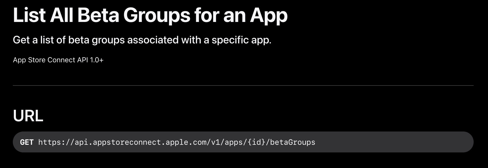

# appstoreconnectr

<!-- badges: start -->
<!-- badges: end -->

`{appstoreconnectr}` is a very minimal package to query the Apple Store Connect API in R.

It allows you to:

- Create a JWT in R
- Query a specific endpoint of the API with that JWT

It doesn't wrap any query, but you'll get a bunch of example below if you need to.

## How to get the credentials

- Open https://appstoreconnect.apple.com/, go to Integration, and

  - Get the 'issuer ID' at the top

  - Create an API key

  - Download the file (it should end with `.p8`)

  - Get the Key Identifier

- Then generate the JWT with :

```r
# Generate a JWT
jwt <- generate_jwt(
  issuer_id = '1234',
  key_id = '1234',
  private_key_path = "/path/to/key.p8"
)
```

See <https://developer.apple.com/documentation/appstoreconnectapi/creating-api-keys-for-app-store-connect-api> for a detailed example.

## How to build the query once you have your JWT

- Get the VERB + URL for the API endpoint



- VERB & URL are both param for `query_api`. Note that VERB should be an `{httr}` function.

- Third arg is the jwt.

- You can pass `...` to `verb()`

## Example

### Listing all your app

```r
query_api(
  httr::GET,
  "https://api.appstoreconnect.apple.com/v1/apps",
  jwt
)
```

### Querying the endpoint "List All Builds of an App"

https://developer.apple.com/documentation/appstoreconnectapi/get-v1-apps-_id_-builds

If your app has the following id "1234-5678"

```r
# Generate a JWT
jwt <- generate_jwt(
  issuer_id = '1234',
  key_id = '1234',
  private_key_path = "1234"
)

query_api(
  httr::GET,
  glue::glue(
    "https://api.appstoreconnect.apple.com/v1/apps/{id}/builds",
    id = "1234-5678"
  ),
   jwt
)
```

## Installation

You can install the development version of `{appstoreconnectr}` like so:

``` r
# FILL THIS IN! HOW CAN PEOPLE INSTALL YOUR DEV PACKAGE?
```


